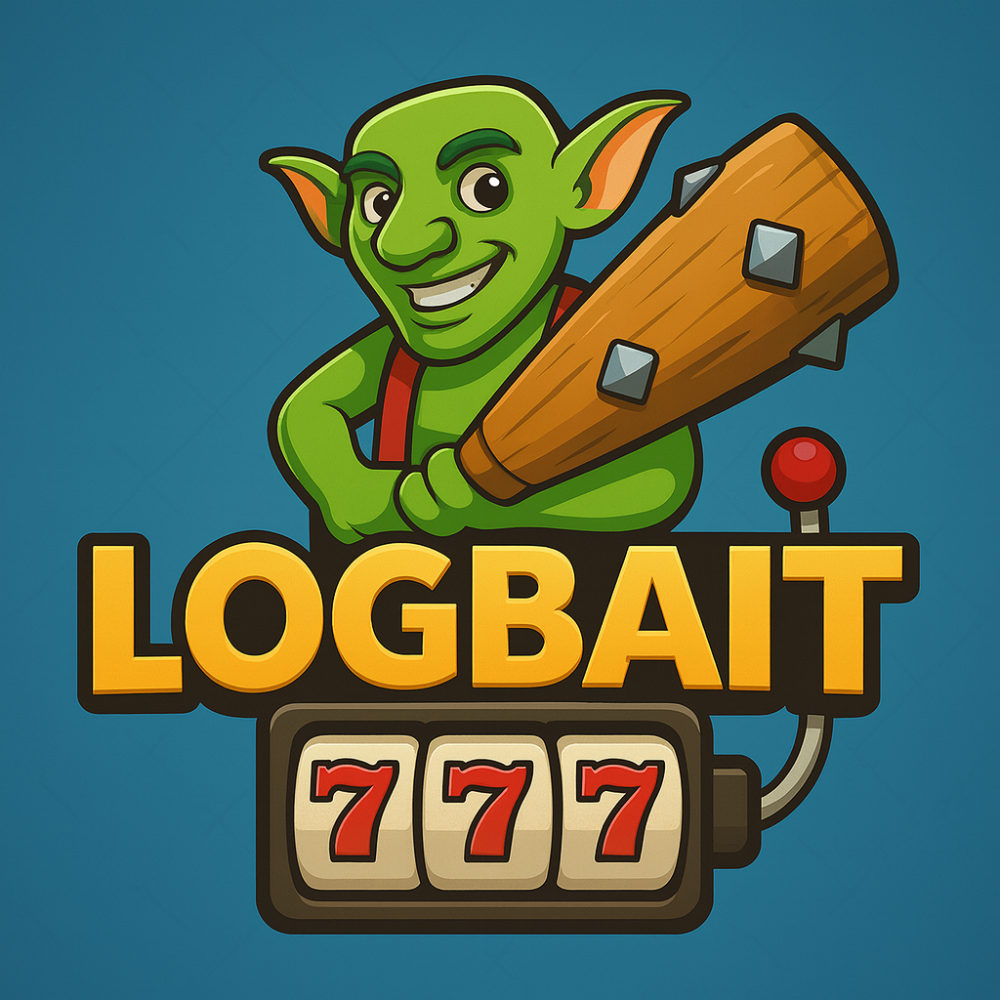

  

<h1 align="center">
  
</h1>

  Plataforma de Apuestas Online

  <a href="https://github.com/UCM-FDI-DISIA/proyectois1-thatwasepic/wiki">Ver Wiki</a>
  ·
  <a href="https://github.com/UCM-FDI-DISIA/proyectois1-thatwasepic/issues/new">Reportar bug</a>

  <em>Instancias activas:</em>
   
  <a href="https://logbait.onrender.com/"><b>logbait.onrender.com</b></a>
   
  <a href="https://logbait.pythonanywhere.com/"><b>logbait.pythonanywhere.com</b></a>

---

**LogBait** es una plataforma web de apuestas desarrollada como proyecto académico.

Su objetivo es ofrecer una experiencia sencilla, segura y responsable para los usuarios interesados en realizar apuestas en línea de manera simulada.

> [!NOTE]
> Este proyecto no gestiona dinero real. Todas las operaciones y apuestas son ficticias y tienen únicamente fines educativos.

---

## 🧩 Descripción general

LogBait permite a los usuarios registrarse, gestionar su saldo virtual, realizar apuestas en distintos juegos y consultar los resultados obtenidos.

El proyecto se ha desarrollado aplicando **metodologías ágiles**, con iteraciones cortas y una planificación basada en **historias de usuario**.

Actualmente se encuentra en su primera fase **MVP (Producto Mínimo Viable)**, cuyo propósito es ofrecer una versión funcional que cubra las características esenciales de una casa de apuestas online.
Según vayamos avanzando en el proyecto, seguiremos implementando historias de usuario que aportarán versatilidad y comodidad al usuario. las funcionalidades concretas de estas historias se pueden observar en el apartado de **Próximos pasos**.

Se puede encontrar información más detallada sobre el proyecto y su gestión en la [Wiki del repositorio](https://github.com/UCM-FDI-DISIA/proyectois1-thatwasepic/wiki).

---

## 🎯 Objetivo del MVP

El MVP busca validar la **viabilidad y usabilidad básica** de la plataforma.  
Incluye las funcionalidades mínimas necesarias para que un usuario pueda:

1. Registrarse e iniciar sesión.  
2. Gestionar su perfil y saldo virtual.  
3. Establecer límites de depósito para fomentar el juego responsable.  
4. Realizar apuestas simples y visualizar sus resultados.
5. Consultar su saldo y su historial básico de movimientos.

---

## ⚙️ Funcionalidades del MVP

### 👤 Gestión de usuarios
- Registro e inicio de sesión seguros.
- Perfil editable con información básica del usuario.
- Cierre de sesión.  

### 💰 Gestión de saldo
- Depósito y retirada de saldo virtual.  
- Límite de depósito configurable por el usuario.  
- Aviso cuando se alcance o se aproxime el límite establecido.  
- Visualización clara del saldo disponible.

### 🎲 Apuestas
- Interfaz sencilla para realizar apuestas en una modalidad de juego (póker o blackjack).  
- Actualización automática de resultados (ganancia o pérdida).  
- Ajuste del saldo según el resultado.  

### 📊 Resultados e historial
- Visualización de resultados recientes.  
- Historial básico de depósitos y pérdidas.

## 📆 Metodología de desarrollo

El proyecto se ha desarrollado aplicando **métodos ágiles**, priorizando la entrega temprana de valor y la iteración constante.  
Las historias de usuario se gestionan en distribuidas en sprints con prioridades **Muy Alta, Alta, Media y Opcional**.

---

## 💡 Próximos pasos

Las futuras iteraciones del proyecto incluirán:
- Más modalidades de juegos multijugador (Póker, Carrera de Caballos multijugador).  
- Sistema de recompensas y promociones con logros.  
- Mejora del sistema de chat (emojis, reacciones, mutes).  
- Estadísticas avanzadas de rendimiento y actividad con gráficos.  
- Soporte para múltiples servidores con sincronización Redis (escalabilidad).  
- Mejoras de accesibilidad y experiencia de usuario en dispositivos móviles.  
- Sistema de torneos y ligas entre jugadores.

---

## 👥 Créditos

Este proyecto está desarrollado por un equipo de 7 personas, compuesto por las siguientes:

---

## ⚠️ Aviso legal

Este proyecto tiene **fines exclusivamente académicos**.  
No se maneja dinero real ni se promueve el juego con apuestas monetarias.  
El contenido está destinado a la **evaluación de conocimientos técnicos y metodológicos**.
